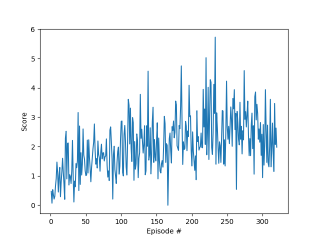
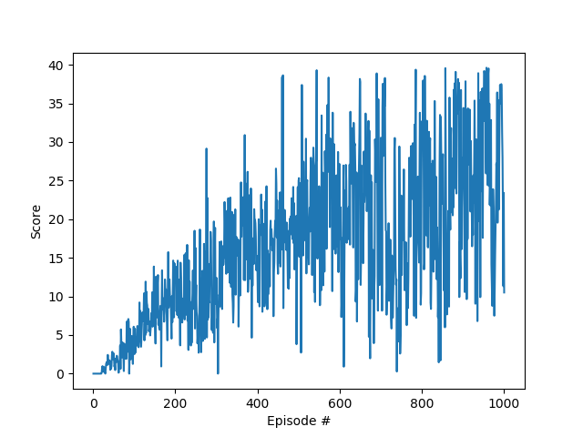

## Udacity Deep Reinforcement Learning Nanodegree
# Continuous Control Project Report

### Learning Algorithm

This poroject is a solution to the Reacher environment using [Deep Deterministic Policy Gradients (DDPG)](https://arxiv.org/abs/1509.02971).  
The following is a short overview of DDPG, which can be seen as an adaptation of Deep Q-Networks to the case of 
countinuous action space.
For a very basic overview od DQN and of its building blocks, please refer the report for my previous projects [qnet_navigation](https://github.com/csggnn/qnet_navigation/blob/master/Report.md)
For a more detailed description of DDPG please refer to the orignial paper, or if you want to dig deeper into reinforcement learning consider the 
[Udacity Deep Reinforcement Learning Nanodegree](https://eu.udacity.com/course/deep-reinforcement-learning-nanodegree--nd893).

#### Intutition of Deep Deterministic Policy Gradients

**Deep Deterministic Policy Gradients** can be seen as an adaptation of DQN to the case of continuous action spaces.

In DQN a neural network is used as a function approximator of the representation of a Q function mapping each possible 
state in a continuous state space to set of Q values, one for each possible action. An agent feed a state observation to 
DQN and select the action corresponding to the highest Q value for that state.

If the action space is continuous, this approach no longer works, as a DQN can only produce a finite set of action value
 while the possible actions are infinite. 
 
DQN is a value method, it uses a neural network to model an action value function, producing an action value for each 
possible action in a state.
DDPG modifies DQN by using 2 networks: an actor network estimates the best action for an input state, while a critic 
network estimates the action value associated an input state, and the action selected by the actor.

The actor network uses the critic network to optimize its weights: weights are updated by gradient ascent, maximizing the
action value associated to the actions which the network would select for each state. This action value is obtained
from the critic network.

The critic network uses the action network as input, the action selected by the action network is fed as an input to the 
fully connected layers of the critic network which estimate the Q value associated to that specific action.
 
Experience replay is still used to decorrelate inputs, and, similarly to DQN, both the actor and the ctritic networks 
are doubled: each defines a local network which is actually trained, and a separated target network which is used for 
computing expected output.

### Implementation

#### Preliminary notes 

This project uses the baseline implementation of DDPG, with some modifications mainly related to the random component of
actions.

#### Project structure

 - **ddpg_reacher_SOLUTION.py** is the main file of the project. It can train a DDPG agent on a set of environments, 
    display random runs of the environemnts and load a trained DDPG agent.
    currently, *ddpg_reacher_solution("show")* is called at line 202 to show the behavior of a trained agent. select 
    *ddpg_reacher_solution("train")* to train a new agent.

 - **train_DQN_agent.py** is the main file used during development the QAgent class implemented in 
    q_agent.py and the file used for training the selected DQN agent.
    This file can be used to retrain the successful agent or to train new agents for the Banana Collection environment 
    as well as for the CartPole and LunarLanding environemnts.
 - **continuous_action_env.py**, **continuous_gym_env.py** and **reacher1_env.py**: wrappers to the gym and reacher 
    environments, they have been developed so that the DDPG agent can be run both gym and Reacher environments with the 
    same code. LunarLanderContinuous an Pendulum environments have been used to verify the ability of the code to solve 
    simple environments before passing to the more complex reacher task.
 - **ddpg_agent.py**: Agent with minor modifications with respect to the baseline implementation
 - **model.py**: Neural network models used by ddpg_agent.py
 - **param_optim.py** is a random parameter optimization script used to test several parameter configurations.

#### Modifications

##### Random actions

In its original implementation, a random noise of magnitude comparable to the magnitude of the agent's acions was added 
to guarantee proper exploration. This noise component has been found too large and impacting on performance. 
In the implementation used in this project:
 - noise is added to episodes only with probability p: while some episodes are run with noise, others follow the learned 
 deterministic policy. If noise is always added to actions, states requiring precise actions may never be reached.
 - noise has lower magnitude and is reduced over time: similar to decaying epsilon for epsilon greedy policies.

This modification has been effective in the solution of the 2 gym environments, but did not lead to a solution of the 
Reacher environment. 

Restults obtained with ddpg and modified noise after parameter optimization are shown in the following graph.

##### Fill before learn

Experience buffer is used to decorrelate sampled experiences and thus reduce instability. If sampes
are drawn form experience buffer as soon as a whole batch is available, anyhow, these samples will be indeed correlated 
and stability may be compromised. A simple modification consists in triggering learn only when the experiance buffer has 
collected sufficient samples. 

In my implementation, the experience buffer has 100000 samples capacuty, and batches will be drawn only when at least 20000
samples are stored. With this simple modification, ddpg algorithm was able to reach reaching average score
values beyond 25 in 1000 episodes, although not solving the environment.

Weights leading to these results have been saved and used as a starting point for 500 additional episodes of training, 
but ddpg revealed its instability. 

### Results

As can be seen from the following graph, my presented solution does not solve the environment. I am presenting it now considering the deadline and 
hoping some mistakes can be highlighted which will guide my future developments.

I first attempted to follow the instructions in Benchmark solution (attempt 2), which substatially suggests to just
plug the Reacher environment to the vanilla DDQN provided, but my results are very different from the graph presented in the notebook.
 
I then added some modification and a parameter optimization, which never beyond average score of 4.

Before adding extra logic, new algorithms and other changes I would like to make sure what has been done up to now is 
correct and learning is not prevented by some mistake i am not able to detect at the moment.

